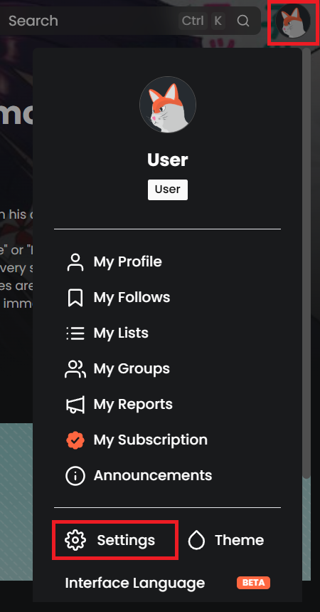
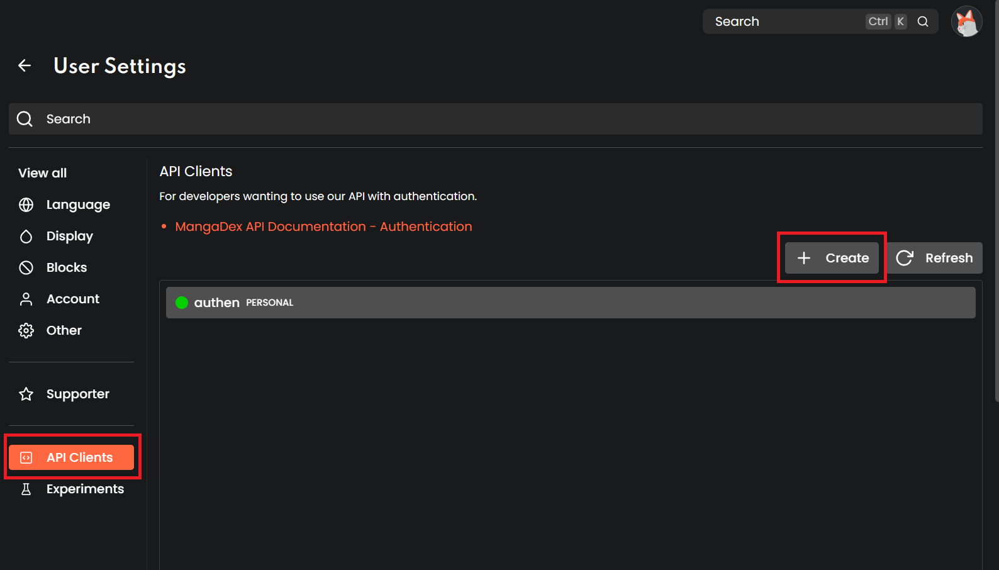

# mangadex-readinglist-extractor
Thing i thought of at 1am cuz mangadex might get nuked

## What it does

This script extracts your reading list from mangadex and saves it to a text file grouped by statuses, it will only add new titles to the text file, so you can periodically run it whenever you add new titles

## How to use

1. Clone the repository
``` bash
git clone https://github.com/yourusername/mangadex-readinglist-extractor.git
```

2. Install the dependencies
``` bash
pip install dotenv
```

3. Create a .env file with your credentials
``` bash
copy .env.example .env
```
- To get your client profile credentials, 
  1. Login to your account on mangadex
  2. Click profile, and head to settings  
  
  3. Head to the API Client menu, and create a new client profile
  
  4. Click the newly created profile, get your client id (personal-client-somethingsomething) and client secret
  
  
4. Run the script
``` bash
python sync.py
```
